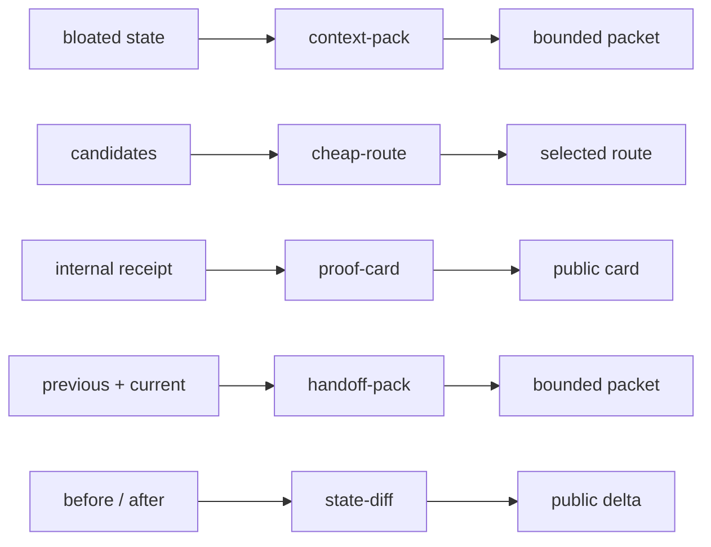

# Quickstart

Public micro-plugin CLIs you can install from a Git tag and run in under 60 seconds. This repo is **not** Neuruh Core, AXON, Mother, IAR, DeedSonar, or JGI.

PyPI: **not published**. Cursor Marketplace: **not submitted**. Install from a GitHub tag. Local Agent Plugin only.

## 30-second why

Five small transforms. No model. No API key. No network after install.

```text
bloated state      -> context-pack  -> bounded packet
candidates         -> cheap-route   -> selected route
internal receipt   -> proof-card    -> public card
before / after     -> state-diff    -> public delta
previous + current -> handoff-pack  -> bounded handoff packet
```



| CLI | Why it exists |
| --- | --- |
| `neuruh-context-pack` | Compile a bounded execution packet instead of replaying chat. Unknown keys are dropped. Transcript/chat keys are refused. |
| `neuruh-cheap-route` | Pick the cheapest route that still clears a success floor, so a competent L0 beat an unnecessary frontier call. |
| `neuruh-proof-card` | Project an internal-looking record through a public allowlist. Private junk is omitted, not refused. |
| `neuruh-state-diff` | Report added/removed/changed paths between two public JSON objects. Grants no authority. |
| `neuruh-handoff-pack` | Form A: pack `previous.json` + `current.json` into a continuation packet with required `parent_mission_id` and a derived path delta. CLI + skill; not an MCP tool. |

They are edge utilities, not a second orchestrator. Details: [`MICRO_PLUGINS.md`](MICRO_PLUGINS.md).

## Install (pin a tag)

Python 3.11+. Network is required only to fetch pinned GitHub dependencies.

**Currently live tag:** `v0.1.6-alpha` (use this until this PR merges).
**This PR cuts:** `v0.1.7-alpha` (switch the tag after the GitHub Release exists).

Tagged clone (needed for the demo files under `examples/demos/`):

```bash
git clone --branch v0.1.6-alpha --depth 1 https://github.com/NeuruhAI/neuruh-sovereign-agent-starter.git
cd neuruh-sovereign-agent-starter
python3 -m venv .venv
source .venv/bin/activate
pip install .
```

Equivalent pip-from-git one-liner (CLIs only; example JSON files are **not** in the wheel):

```bash
python3 -m venv .venv && source .venv/bin/activate
pip install "neuruh-sovereign-agent-starter @ git+https://github.com/NeuruhAI/neuruh-sovereign-agent-starter.git@v0.1.6-alpha"
# after this PR's release, switch the tag to v0.1.7-alpha
```

Older live tag, still valid:

```bash
pip install "neuruh-sovereign-agent-starter @ git+https://github.com/NeuruhAI/neuruh-sovereign-agent-starter.git@v0.1.5-alpha"
```

`v0.1.5-alpha` used the envelope CLI `neuruh-handoff-pack STATE.json [--before] [--after] [--receipt]`. From `v0.1.6-alpha` the Form A CLI is `neuruh-handoff-pack previous.json current.json [--max-bytes]`.

Confirm the installed version:

```bash
python -c "import importlib.metadata as m; print(m.version('neuruh-sovereign-agent-starter'))"
```

`plugin_demo` (`python -m neuruh_sovereign_agent_starter.plugin_demo`) reads `examples/*.synthetic.json` from a checkout. After a pip-only install it will fail because those files are not packaged. Use the clone + `pip install .` path, or call the CLIs on files you already have.

## Demo A — context-pack

```bash
neuruh-context-pack examples/demos/bloated-mission.synthetic.json
```

Expected shape (unknown keys such as `ignored_blob` are absent; packet is under 4096 bytes):

```json
{
  "mission_id": "DEMO-A",
  "objective": "pack a bounded public packet from a noisy caller object",
  "next_action": "run neuruh-context-pack"
}
```

Optional refusal (one line on stderr, exit 1 — not a traceback):

```bash
neuruh-context-pack examples/demos/bloated-mission.transcript-refuse.synthetic.json
```

```text
raw conversational context is not accepted: transcript
```

## Demo B — cheap-route

```bash
neuruh-cheap-route examples/demos/three-routes.synthetic.json --min-success 0.8
```

Expected shape (cheapest capable is the L0; the L2 and L4 candidates lose):

```json
{
  "candidate_id": "deterministic-l0",
  "layer": "L0",
  "score": 94.985,
  "expected_value_usd": 100.0,
  "total_cost_usd": 0.015
}
```

## Demo C — proof-card

```bash
neuruh-proof-card examples/demos/internal-receipt-junk.synthetic.json
```

Expected shape (`private_recipe`, `prompt`, `transcript`, and other junk are omitted). Proof-card is an **allowlist**: unknown keys are dropped silently. That is different from context-pack, which **refuses** transcript/chat keys.

```json
{
  "mission_id": "DEMO-C",
  "status": "PASS",
  "version": "0.1.7-alpha"
}
```

Verify a committed public card the same way:

```bash
neuruh-proof-card examples/demos/docs-release-receipt.synthetic.json
```

The checked-in output is [`PUBLIC_PROOF_CARD.v0.1.7-alpha.json`](PUBLIC_PROOF_CARD.v0.1.7-alpha.json). Its `limitations` state this is packaging/docs, not a production receipt. `commit_sha` is a synthetic placeholder until the merge SHA is known.

## Optional Demo D — state-diff + handoff-pack (Form A)

```bash
neuruh-state-diff examples/demos/state-before.synthetic.json examples/demos/state-after.synthetic.json
neuruh-handoff-pack examples/demos/state-before.synthetic.json examples/demos/state-after.synthetic.json
```

State-diff prints `added` / `changed` / `removed` paths and `unchanged`. Handoff-pack prints a context packet with `parent_mission_id` taken from the previous `mission_id` and `changed_since_last_run` derived as `added:` / `changed:` / `removed:` path strings. Caller-supplied deltas are ignored. `giant_payload` is dropped.

## MCP

Exactly three MCP tools: `context_pack`, `cheap_route`, `proof_card`. No fourth tool. `neuruh-state-diff` is CLI-only. `neuruh-handoff-pack` is CLI plus skill, not MCP.

### Cursor: local plugin copy

`mcp.json` sets `PYTHONPATH=${PLUGIN_ROOT}/src` so a **source-tree copy** can load without pip. Copy as a real directory, not a symlink out of `~/.cursor/plugins/local`:

```bash
mkdir -p ~/.cursor/plugins/local
rm -rf ~/.cursor/plugins/local/neuruh-public-micro-plugins
cp -R . ~/.cursor/plugins/local/neuruh-public-micro-plugins
```

Reload the Cursor window. Customize should show plugin `neuruh-public-micro-plugins`, skills, and MCP tools `context_pack`, `cheap_route`, `proof_card`.

### Claude Desktop / generic stdio (pip-installed)

After `pip install`, run the module with **no PYTHONPATH**. CWD can be anywhere:

```json
{
  "mcpServers": {
    "neuruh-public-micro-plugins": {
      "command": "python3",
      "args": ["-m", "neuruh_sovereign_agent_starter.mcp_server"]
    }
  }
}
```

Use the venv's `python3` if the module is not on the system interpreter.

## Skills

| Skill | Invoke with |
| --- | --- |
| `neuruh-context-pack` | MCP tool `context_pack` |
| `neuruh-cheap-route` | MCP tool `cheap_route` |
| `neuruh-proof-card` | MCP tool `proof_card` |
| `neuruh-handoff-pack` | CLI `neuruh-handoff-pack previous.json current.json` (not MCP) |

## Governed-exec starter

This repo also ships a bounded governed-exec example. That path is separate from the micro-plugin CLIs. See [`README.md`](README.md) under **Governed-exec starter**.
